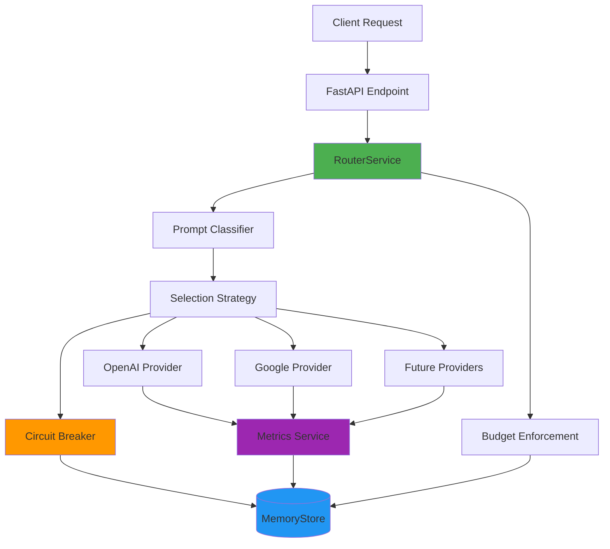

# LLM Routing Service

An intelligent LLM request routing service built with Python 3.13, FastAPI, and Pydantic v2. This service routes chat
requests across multiple LLM providers (OpenAI, Google) with circuit breaker patterns, rate limiting, cost optimization,
and automatic fallback handling.

## Features

- **Intelligent Routing**: Classifies prompts and routes to the best provider based on user preferences (cost, speed, or
  quality)
- **Circuit Breaker**: Automatically detects failing providers and routes around them
- **Rate Limiting**: Per-provider rolling 60-second rate limit enforcement
- **Cost Optimization**: Estimates costs and respects per-request budget caps
- **User Budgets**: Enforces $1.00 spending cap per user
- **Automatic Fallback**: Tries multiple providers in order until success
- **Comprehensive Metrics**: Global and per-provider analytics

## Project Structure

```
llm_router/
├── app/                     # Application code
│   ├── __init__.py
│   ├── main.py              # App factory
│   ├── dependencies.py      # Dependency injection
│   ├── config.py            # Settings & provider registry
│   ├── models.py            # Pydantic models
│   ├── exceptions.py        # Custom exceptions
│   ├── logging_config.py    # Logging setup
│   ├── middleware.py        # HTTP middleware & error handlers
│   ├── api/                 # API routers
│   │   ├── __init__.py
│   │   ├── health.py        # Health & root endpoints
│   │   ├── chat.py          # Chat completions
│   │   ├── providers.py     # Provider management
│   │   └── analytics.py     # Metrics & analytics
│   ├── services/            # Service layer
│   │   ├── __init__.py
│   │   └── router_service.py # Request routing orchestration
│   ├── providers/           # LLM provider implementations
│   │   ├── base.py          # Abstract provider interface
│   │   ├── factory.py       # Provider factory
│   │   ├── mock.py          # Mock provider for testing
│   │   ├── openai.py        # OpenAI client
│   │   └── google.py        # Google Gemini client
│   ├── routing/             # Routing logic
│   │   ├── classifier.py    # Prompt classification
│   │   ├── strategy.py      # Provider selection strategy
│   │   ├── circuit_breaker.py  # Circuit breaker pattern
│   │   └── metrics.py       # Metrics aggregation
│   └── storage/             # State management
│       └── memory.py        # In-memory state management
├── tests/                   # Test suite
│   ├── conftest.py          # Pytest fixtures
│   ├── test_api.py          # API endpoint tests
│   ├── test_models.py       # Model validation tests
│   ├── test_circuit_breaker.py  # Circuit breaker tests
│   ├── test_strategy.py     # Provider selection tests
│   ├── test_integration.py  # Integration & classifier tests
│   ├── test_budget.py       # Budget enforcement tests
│   └── test_memory.py       # Memory store & rate limiting tests
├── providers.yaml           # Provider specifications
├── classifier_keywords.yaml # Classifier keyword configuration
├── pyproject.toml           # Project dependencies & config
├── README.md                # This file
└── ROUTING_STRATEGY.md      # Routing algorithm documentation
```

## Architecture



### Key Components

- **RouterService**: Orchestrates request handling, provider selection, and fallback logic
- **Circuit Breaker**: Monitors provider health and prevents cascading failures (CLOSED → OPEN → HALF_OPEN states)
- **MemoryStore**: Thread-safe singleton for metrics, circuit breaker state, and user budgets
- **Provider Factory**: Dynamically loads real or mock providers based on configuration
- **Metrics Service**: Tracks success rates, latency, costs, and provider availability

## Provider Modes

The service supports two operating modes for flexibility during development and production:

### Mock Mode (Default for Development)

**When to use**: Local development, testing, CI/CD pipelines

**Configuration**:
```bash
# In .env file
MOCK=1
MOCK_FAILURE_RATE=0.1  # 10% simulated failure rate
```

**Behavior**:
- No actual API calls to OpenAI or Google
- Simulates realistic latency based on `providers.yaml` specifications
- Returns mock responses with accurate cost estimates
- Deterministic behavior with configurable failure rate
- Respects rate limits and circuit breaker logic
- Perfect for testing without API costs

**Example Response**:
```json
{
  "provider_used": "openai",
  "content": "Mock response from openai: Write a Python function...",
  "latency_ms": 203,
  "cost": 0.00045
}
```

### Real Provider Mode (Production)

**When to use**: Production deployments with actual LLM providers

**Configuration**:
```bash
# In .env file
MOCK=0
OPENAI_API_KEY=sk-proj-...
GOOGLE_API_KEY=AIza...
```

**Behavior**:
- Makes real API calls to configured providers
- Uses actual API keys from environment variables
- Returns real LLM responses
- Incurs actual API costs
- All routing, circuit breaking, and budget features still apply

**Provider Setup**:

1. Get API keys:
   - OpenAI: https://platform.openai.com/api-keys
   - Google Gemini: https://aistudio.google.com/app/apikey

2. Copy `.env.example` to `.env`:
   ```bash
   cp .env.example .env
   ```

3. Configure your keys:
   ```bash
   MOCK=0
   OPENAI_API_KEY=your-actual-openai-key
   GOOGLE_API_KEY=your-actual-google-key
   ```

4. Update provider models in `providers.yaml` or override via environment:
   ```bash
   OPENAI_API_MODEL=gpt-5
   GOOGLE_API_MODEL=gemini-3-pro
   ```

**Automatic Switching**: The provider factory automatically selects the appropriate provider implementation based on the `MOCK` setting—no code changes required.

## Getting Started

New to the project? Here's a quick path to get up and running:

1. **Install uv** (if you haven't already):
   ```bash
   # Windows (PowerShell)
   powershell -c "irm https://astral.sh/uv/install.ps1 | iex"
   
   # macOS/Linux
   curl -LsSf https://astral.sh/uv/install.sh | sh
   ```

2. **Clone and setup**:
   ```bash
   cd llm_router
   uv sync  # Install all dependencies
   ```

3. **Run in mock mode** (no API keys needed):
   ```bash
   uv run uvicorn app.main:app --reload
   ```

4. **Test the service**:
   ```bash
   # In a new terminal
   curl -X POST http://localhost:8000/chat/completions \
     -H "Content-Type: application/json" \
     -d '{"prompt": "Write a Python hello world program"}'
   ```

5. **Explore the interactive docs**: Visit http://localhost:8000/docs

6. **Run the tests**:
   ```bash
   uv run pytest -v
   ```

That's it! You're now ready to explore the routing logic, circuit breakers, and other features.

## Running Locally


### Prerequisites

- [uv](https://github.com/astral-sh/uv) (for dependency management)
- Python 3.13+

### Installation

1. Sync dependencies:

```bash
uv sync
```

2. Run the service:

```bash
uv run uvicorn app.main:app --host 0.0.0.0 --port 8000 --reload
```

The service will be available at `http://localhost:8000`

### Development

Format code:

```bash
uv run ruff format .
```

Lint code:

```bash
uv run ruff check --fix .
```

### Testing

Run the test suite:

```bash
uv run pytest tests/ -v
```

Run with coverage report:

```bash
uv run pytest --cov=app --cov-report=term-missing
```

Generate HTML coverage report:

```bash
uv run pytest --cov=app --cov-report=html
open htmlcov/index.html  # View in browser
```

**Note**: Tests automatically use `.env.test` configuration with `MOCK=1` and `MOCK_FAILURE_RATE=0.0` for predictable behavior.


## Running with Docker

### Quick Start

```bash
docker compose up
```

The service will be available at `http://localhost:8000`

### Build and run manually

```bash
docker build -t llm-router .
docker run -p 8000:8000 llm-router
```

## API Endpoints

### POST /chat/completions

Send a chat request to be routed to the best available provider.

**Request:**

```bash
curl -X POST http://localhost:8000/chat/completions \
  -H "Content-Type: application/json" \
  -d '{
    "prompt": "Write a Python function to calculate fibonacci numbers",
    "preferences": {
      "priority": "cost",
      "max_cost_per_request": 0.01,
      "timeout_ms": 5000
    },
    "user_id": "user123"
  }'
```

**Response:**

```json
{
  "provider_used": "google",
  "content": "Mock response from google: Write a Python function to calculate fibonacci...",
  "latency_ms": 252,
  "cost": 0.000675
}
```

### GET /providers

Get status of all providers including circuit breaker status and metrics.

**Request:**

```bash
curl http://localhost:8000/providers
```

**Response:**

```json
[
  {
    "name": "openai",
    "model": "gpt-5",
    "cost_per_token": 0.00002,
    "latency_ms": 200,
    "rate_limit_rpm": 100,
    "specialties": [
      "code",
      "analysis",
      "writing"
    ],
    "quality_score": 0.95,
    "is_down": false,
    "circuit_status": "CLOSED",
    "success_rate": 0.89
  },
  {
    "name": "google",
    "model": "gemini-pro",
    "cost_per_token": 0.000015,
    "latency_ms": 250,
    "rate_limit_rpm": 150,
    "specialties": [
      "writing",
      "analysis"
    ],
    "quality_score": 0.94,
    "is_down": false,
    "circuit_status": "CLOSED",
    "success_rate": 0.92
  }
]
```

### GET /routing/analytics

Get comprehensive analytics including global and per-provider metrics.

**Request:**

```bash
curl http://localhost:8000/routing/analytics
```

**Response:**

```json
{
  "global": {
    "total_requests": 150,
    "total_success": 135,
    "total_failures": 15,
    "avg_latency_ms": 215.3,
    "total_cost": 0.0456,
    "success_rate": 0.9
  },
  "providers": {
    "openai": {
      "requests": 70,
      "success": 62,
      "failures": 8,
      "success_rate": 0.886,
      "avg_latency_ms": 203.4,
      "is_down": false,
      "circuit_status": "CLOSED"
    },
    "google": {
      "requests": 80,
      "success": 73,
      "failures": 7,
      "success_rate": 0.9125,
      "avg_latency_ms": 225.8,
      "is_down": false,
      "circuit_status": "CLOSED"
    }
  }
}
```

### POST /simulate/failure

Simulate provider failures for testing circuit breaker behavior.

**Request:**

```bash
curl -X POST http://localhost:8000/simulate/failure \
  -H "Content-Type: application/json" \
  -d '{
    "provider": "openai",
    "down": true
  }'
```

**Response:**

```json
{
  "message": "Provider openai set to down=true"
}
```

To bring the provider back up:

```bash
curl -X POST http://localhost:8000/simulate/failure \
  -H "Content-Type: application/json" \
  -d '{
    "provider": "openai",
    "down": false
  }'
```

## User Preferences

### Priority Options

- **`cost`** (default): Selects the cheapest provider
- **`speed`**: Selects the fastest provider
- **`quality`**: Selects the highest quality provider

### Max Cost Per Request

Set a budget cap for individual requests. Providers exceeding this cost will be filtered out.

```json
{
  "preferences": {
    "priority": "quality",
    "max_cost_per_request": 0.005
  }
}
```

### User Budget Enforcement

The service implements a per-user spending cap of **$1.00** total across all requests. This prevents cost overruns and enables predictable billing for multi-tenant deployments.

#### How It Works

Each user is identified by an optional `user_id` field in the chat request:

```json
{
  "prompt": "Your prompt here",
  "user_id": "user123",
  "preferences": {
    "priority": "quality"
  }
}
```

When `user_id` is provided:

1. The system checks current total spend for that user
2. If spend exceeds $1.00, the request is rejected with HTTP 402 (Payment Required)
3. If within budget, the request proceeds normally
4. After successful completion, the response cost is added to the user's total spend

#### Budget Exceeded Response

When a user exceeds their $1.00 limit:

**HTTP Status**: 402 Payment Required

**Response Body**:

```json
{
  "detail": "Budget exceeded"
}
```

#### Anonymous Requests

If `user_id` is not provided (or is `null`), no budget tracking occurs. The request proceeds without spending limits. This is useful for:

- Testing and development
- Anonymous public endpoints
- Internal system requests

#### Implementation Details

**Storage**: User spending is tracked in-memory using the `MemoryStore` singleton with thread-safe operations.

**Cost Calculation**: Costs are estimated using tiktoken for accurate token counts, then multiplied by the provider's cost per token.

**Budget Resets**: In the current in-memory implementation, budgets reset when the service restarts. For production deployments, consider database persistence for budget tracking across restarts.

#### Testing Budget Enforcement

Make requests with a user_id and monitor spending:

```bash
curl -X POST http://localhost:8000/chat/completions \
  -H "Content-Type: application/json" \
  -d '{
    "prompt": "Write a very long essay about the history of computing",
    "user_id": "testuser"
  }'
```

Repeat until total cost exceeds $1.00, then observe the 402 response.

> [!WARNING]
> User IDs should be authenticated in production. Validate user_id against a session or JWT token to prevent unauthorized access.


## Architecture

The service implements a sophisticated routing strategy:

1. **Classification**: Analyzes prompts to determine type (code, writing, analysis)
2. **Filtering**: Removes unavailable providers and those exceeding budget
3. **Ranking**: Sorts by user priority (cost/speed/quality)
4. **Boosting**: Prioritizes providers with matching specialties
5. **Fallback**: Automatically tries next provider on failure

See [ROUTING_STRATEGY.md](ROUTING_STRATEGY.md) for detailed explanation.

## Documentation

- [ROUTING_STRATEGY.md](ROUTING_STRATEGY.md) - Detailed routing algorithm explanation
- [Classifier Keywords](classifier_keywords.yaml) - Prompt classification configuration

## Interactive API Documentation

Once the service is running, visit:

- Swagger UI: http://localhost:8000/docs
- ReDoc: http://localhost:8000/redoc
