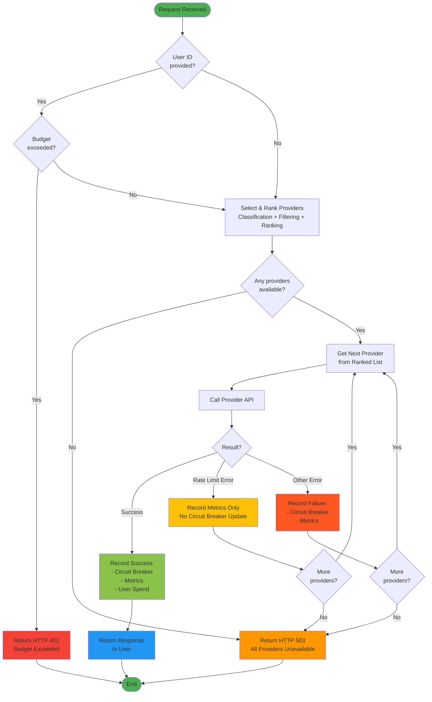

# LLM Routing Strategy

## Overview

The LLM Routing Service implements an intelligent multi-stage routing algorithm that selects the optimal provider for
each request based on prompt classification, provider availability, user preferences, and cost constraints.

## Routing Pipeline

### 1. Classification

The system analyzes the prompt content to determine request type:

- **Code**: Contains keywords like "def", "class", "import", "exception"
- **Writing**: Contains keywords like "essay", "blog", "email", "summarize"
- **Analysis**: All other requests

This classification enables specialty-based provider matching in later stages.

### 2. Filtering

Providers are filtered based on multiple criteria:

**Configuration Validation**: Provider specifications loaded from `providers.yaml` are validated using Pydantic to ensure:
- `quality_score` is between 0.0 and 1.0
- `cost_per_token` is greater than 0
- `rate_limit_rpm` and `latency_ms` are positive
- `specialties` are from allowed types ("code", "writing", "analysis")

**Circuit Breaker Status**: Providers with open or half-open circuits are excluded. The circuit breaker tracks
consecutive failures (threshold: 3) and prevents routing to unhealthy providers for 60 seconds.

**Manual Downtime**: Administrators can manually mark providers as down using the `/simulate/failure` endpoint.

**Cost Constraints**: If the user specifies `max_cost_per_request`, providers whose estimated cost exceeds this limit
are filtered out. Cost estimation uses: `tokens = tiktoken.encode(prompt)` and `cost = tokens × provider.cost_per_token`.

### 3. Ranking

Remaining providers are sorted according to user priority:

- **Cost Priority** (default): Sorts by estimated cost ascending
- **Speed Priority**: Sorts by provider latency_ms ascending
- **Quality Priority**: Sorts by quality_score descending

This ensures the most suitable provider (by user preference) is tried first.

### 4. Specialty Boosting

Providers whose specialties match the classified request type receive a slight scoring boost (10% improvement in their
ranking score).

- For **Cost/Speed** priorities: The score (cost or latency) is multiplied by 0.9 (made smaller/better).
- For **Quality** priority: The score (negative quality) is multiplied by 1.1 (made more negative/better).

This ensures that specialists are preferred when costs/latencies are similar, but a generalist that is significantly
cheaper or faster can still win.

**Example**:

Suppose we have a **code-related prompt** with **cost priority**:

| Provider | Cost (estimated) | Specialties | Has Match? | Boost Applied | Final Score |
|----------|------------------|-------------|------------|---------------|-------------|
| OpenAI   | $0.0044          | code, writing | ✅ Yes (code) | 0.0044 × 0.9 | **0.00396** (ranked 1st) |
| Google   | $0.0040          | writing, analysis | ❌ No | 0.0040 × 1.0 | 0.00400 (ranked 2nd) |
| Claude   | $0.0050          | code, writing | ✅ Yes (code) | 0.0050 × 0.9 | 0.00450 (ranked 3rd) |

Even though Google has the lowest raw cost ($0.0040), OpenAI wins because its specialty boost (0.00396) makes it more attractive than Google's unboosted cost.

However, if Google's cost was significantly lower (e.g., $0.0030), it would still win despite not being a specialist.

### 5. Fallback Execution

The service iterates through the ranked provider list:

**Success Path**: On successful response, the circuit breaker records success, metrics are updated, user spend is
tracked (if user_id provided), and the response is returned immediately.

**Rate Limit Error**: Does NOT trigger circuit breaker failure (it's a quota issue, not a health issue). The system
continues to the next provider.

**Other Failures**: Trigger circuit breaker failure count increment and metrics recording. The system falls back to the
next provider in the list.

**Complete Exhaustion**: If all providers fail, HTTP 503 (Service Unavailable) is returned.

#### Fallback Logic Flowchart

**Key Decision Points**:
1. **Budget Check**: Enforces per-user spending cap before processing
2. **Provider Availability**: Ensures at least one provider passed filters
3. **Result Evaluation**: Distinguishes between success, rate limits, and failures
4. **Fallback Decision**: Continues to next provider or returns 503

**Fallback Loop**: The system tries each provider in the ranked list until:
- ✅ One succeeds (return response)
- ⚠️ All providers exhausted (return 503)

## Metrics Collection

All request outcomes are tracked:

- **Average latency** is computed over successful requests only (failed requests don't contribute to latency averages)
- **Success rate** = successes / total_requests (safe division handling zero requests)
- **Per-provider metrics** include request count, success count, failure count, success rate, and average latency
- **Global metrics** aggregate across all providers

## Circuit Breaker State Machine

- **CLOSED**: Normal operation, requests flow through
- **OPEN**: After 3 consecutive failures, circuit opens for 60 seconds
- **HALF_OPEN**: After timeout, allows exactly 1 probe request
    - Success → CLOSED (reset failures)
    - Failure → OPEN (another 60 seconds)

This pattern prevents cascading failures and allows automatic recovery when providers become healthy again.

## Design Principles

**Resilience**: Multiple fallback layers ensure high availability even when individual providers fail.

**Cost Awareness**: Respects user budgets at both request and user levels.

**Performance**: Specialty matching and priority-based ranking minimize latency and cost.

**Observability**: Comprehensive metrics enable monitoring and optimization.
